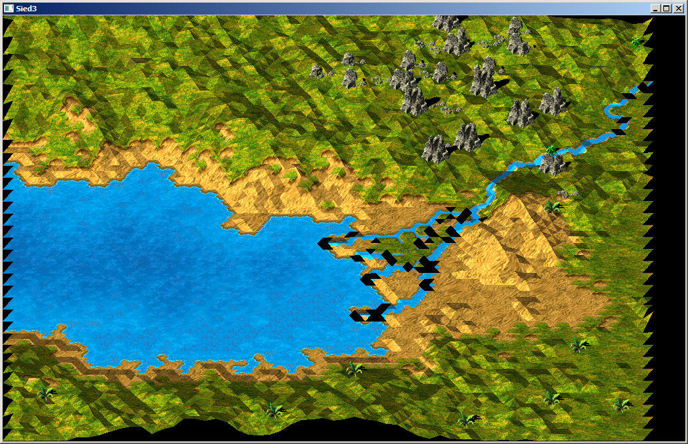
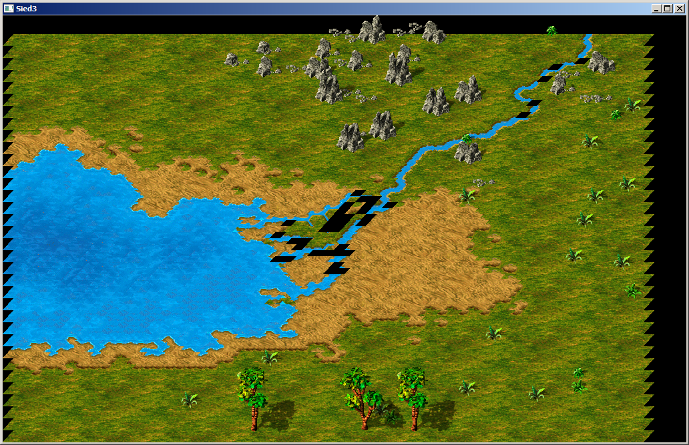

Sied3
=====

Features
--------
* read Siedler 3/Settlers 3 Map Files {area, height, decoration objects, ...}
* read Siedler/Settlers GFX Files {images of objects, shadows, torso, pallets, animation-information}
* render original settlers map file (some glitches)
* render animations

Status
------
2014-10-17

2014-10-14

2014-10-06

2014-09-26

