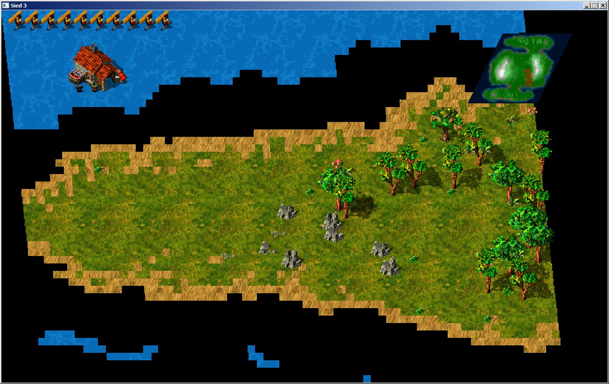

Sied3
=====

Features
--------
* read Siedler/Settlers 3 Map Files {area, height, decoration objects, ...}
* read Siedler/Settlers GFX Files {images of objects, shadows, torso, pallets, animation-information}
* render map (no height level, not all patters)
* render animations

Status
------

